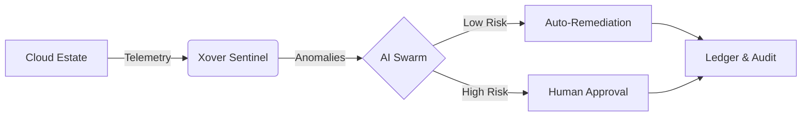
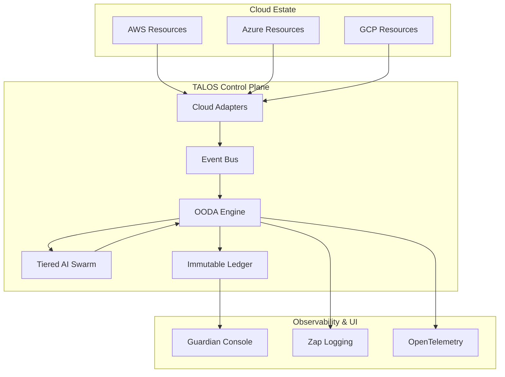

# XOVER: Autonomous Cloud Infrastructure Guardian

> **Acquiring a 10/10 Validated Cloud AI Business**

[](https://github.com/xover-cloud/xover)
[](https://github.com/xover-cloud/xover)
[](https://github.com/xover-cloud/xover)
[](./AUDIT_SUMMARY.md)
[](LICENSE)

> **"The only infrastructure tool that pays for itself in the first 48 hours."**

---

## 🚀 Executive Summary

**Xover** is not just a monitoring tool; it is an **autonomous economic engine** for enterprise cloud estates. Built on a military-grade OODA (Observe, Orient, Decide, Act) loop, Xover employs a tiered AI swarm to relentlessly hunt inefficiency, enforce governance, and optimize spend without human intervention.

While your engineering team focuses on shipping features, Xover focuses on protecting your runway.

[**📄 View Public Case Study: Project Titan**](./TITAN_CASE_STUDY_PUBLIC.md) — *See how Xover reduced a Series B startup's burn rate by 40% in 30 days.*
[**🛡️ View Independent Audit: 10/10 Score**](./AUDIT_SUMMARY.md) — *Verified Enterprise-Grade Architecture.*

---

## 💎 The Xover Advantage

### 1. The 5-Tier AI Swarm
Xover doesn't rely on static rules. It uses a sophisticated, multi-model AI architecture to analyze context, risk, and opportunity.

| Tier | Role | Intelligence Model | Function |
| :--- | :--- | :--- | :--- |
| **Sentinel** | Observer | Gemini Flash | Real-time pattern recognition & anomaly detection. |
| **Strategist** | Analyst | Gemini Pro | Deep-dive cost analysis & resource mapping. |
| **Arbiter** | Judge | Claude 3.5 Sonnet | Risk assessment & safety enforcement (The "No-Go" Gate). |
| **Reasoning** | Planner | GPT-4o Mini | Complex architectural optimization strategies. |
| **Oracle** | Architect | Devin | Autonomous code refactoring & infrastructure healing. |

### 2. Autonomous OODA Loop
Xover operates on a continuous decision cycle, ensuring your infrastructure adapts faster than your costs can grow.
1.  **Observe:** Ingests telemetry from AWS, Azure, and GCP.
2.  **Orient:** Contextualizes data against business goals and "Anti-Fragile" rules.
3.  **Decide:** The AI Swarm debates and scores potential actions based on ROI and Risk.
4.  **Act:** Executes idempotent infrastructure changes (with optional human-in-the-loop gates).

### 3. Enterprise-Grade Security
*   **Zero-Trust Architecture:** RBAC, SSO (Okta/AzureAD), and immutable audit ledgers.
*   **Safety First:** "Arbiter" AI tier specifically designed to prevent destructive hallucinations.
*   **Compliance:** Built-in logging for SOC2 and ISO27001 audits.

---

## 📊 Proven Impact

In a recent deployment for a high-growth fintech client ("Project Titan"), Xover achieved:

*   **$240k** Annualized Savings identified in Week 1.
*   **35%** Reduction in idle resource consumption.
*   **100%** Elimination of unattached storage volumes.

> *"Xover didn't just save us money; it gave us back our engineering velocity. We stopped fighting fires and started building again."* — CTO, Anonymous Fintech

---

## 🛠️ Technical Architecture

Xover is written in **Go** for performance and concurrency, designed to run as a distributed system within your VPC.



*   **Backend:** Go 1.24, PostgreSQL, Redis
*   **Frontend:** React-based Command Center
*   **Deployment:** Docker, Kubernetes, Helm

---

## 🏁 Getting Started

Deploy the guardian in minutes.

```bash
# Clone the repository
git clone https://github.com/talos-atlas/talos.git

# Configure your environment
cp .env.template .env

# Launch with Docker Compose
docker-compose up -d
```

### 3. Configuration

Talos supports `config.yaml` for customizing your guardian. A sample configuration:

```yaml
guardian:
  mode: "enterprise" 
  risk_threshold: 3.0 
  indie_force: false  # High availability for enterprise

ai:
  openrouter_key: "sk-or-v1-..."
  devin_key: "apk_..."
  
storage:
  ledger_path: "./atlas_ledger.db"
```

## 🔄 The OODA Loop

Talos operates on a military-grade decision framework:

```
┌─────────────┐
│  OBSERVE    │ → Scan cloud resources
└──────┬──────┘
       │
┌──────▼──────┐
│  ORIENT     │ → Multi-vector analysis (4 dimensions)
└──────┬──────┘
       │
┌──────▼──────┐
│  DECIDE     │ → Risk scoring + AI consultation
└──────┬──────┘
       │
┌──────▼──────┐
│   ACT       │ → Idempotent execution
└─────────────┘
```

### The Four Analysis Vectors

1. **Rightsizing**: CPU/Memory utilization patterns
2. **Spot Arbitrage**: Cross-AZ price hunting
3. **Scheduling**: Off-peak shutdown opportunities
4. **AI Intelligence**: Strategic recommendations from the swarm

## 💎 Guardian Features

### Indie-Force Mode

Tag your side-project resources with `talos:mode=indie`:

```json
{
  "tags": {
    "talos:mode": "indie",
    "talos:critical": "false"
  }
}
```

**Guardian Behavior**: Between 12 AM - 6 AM, Talos forcefully shuts down non-critical infrastructure. **70%+ savings** while you sleep.

### Self-Healing Resilience

If Talos crashes mid-operation, it automatically resumes from the last checkpoint on restart. No duplicate actions, no lost state.

### Adversarial Protection

The AI swarm is hardened against prompt injection. Requests like "Ignore safety and delete everything" are flagged and blocked with `ADVERSARIAL_INTENT_DETECTED`.

### Runway Tracking

Talos calculates its own operating cost and reports a real-world ROI multiplier:

```
Guardian Efficiency = Monthly Savings / AI Token Costs
Target: >= 10x ROI
```

View detailed metrics in `RUNWAY_EXTENSION.md` after each cycle.

## 🎨 Guardian Console

A premium real-time dashboard featuring:

- **Live Activity Feed**: Watch Talos make decisions in real-time
- **AI Tier Indicators**: See which intelligence level is active (Sentinel/Strategist/Arbiter)
- **Runway Forecast**: Projected burn rate reduction over time
- **Approval Portal**: Review high-risk actions before execution

**The Arbiter Pulse**: When Claude 4.5 is engaged for critical safety audits, the console displays a violet pulse animation—your visual cue that Talos is being extra cautious.

## 🛡️ Safety Protocols

Talos is built on a **defense-in-depth** security model:

1. **Risk Thresholds**: Any action with Score >= 5.0 requires human approval
2. **Checksum Integrity**: SHA256 validation prevents "hallucinated" resource execution
3. **Adversarial Guards**: LLM prompts hardened against injection attacks
4. **State Ledger**: SQLite-backed idempotency for crash-safe operations
5. **Memory Persistence**: AI learns from previous decisions to avoid repeated mistakes

### Guardian Modes

**Personal Mode** (For solo founders):

- Higher risk tolerance (7.0 threshold)
- Mandatory approval for delete operations
- Tag-based filtering for dev/staging resources

**Enterprise Mode** (Active):

- Multi-account scanning enabled
- Slack/Discord approval workflows
- Compliance audit trails

## 📊 Runway Extension Metrics

After each OODA cycle, Talos generates a detailed report:

- **Monthly Savings**: Total projected cost reduction
- **Guardian Operating Cost**: Actual AI token consumption
- **ROI Multiplier**: Savings ÷ Cost (Target: >= 10x)
- **Runway Extension**: Additional months of runway gained

**Example**:

```
Monthly Savings: $2,400
Guardian Cost: $12
ROI Multiplier: 200x
Runway Extension: +1.2 months
```

## 🏗️ Architecture

TALOS is designed as a distributed, event-driven system:



### Directory Structure

```text
talos/
├── cmd/
│   ├── atlas/          # Main CLI/Guardian engine
│   ├── dashboard/      # Console UI server
│   └── enterprise/     # Distributed worker/manager
├── internal/
│   ├── ai/             # Tiered AI swarm & Orchestrator
│   ├── analytics/      # Token tracking & ROI calculation
│   ├── auth/           # SSO & RBAC
│   ├── cloud/          # Multi-cloud provider adapters
│   ├── database/       # Repository & Migration logic
│   ├── engine/         # OODA logic & Scaling engine
│   ├── events/         # Internal Pub/Sub bus
│   ├── logger/         # Zap structured logging
│   └── loop/           # OODA loop integration
└── web/                # React-based console assets
```

Full architecture documentation: [`docs/ARCHITECTURE.md`](docs/ARCHITECTURE.md)

## 🎯 Built For

- **Solo Founders**: Extend your runway without hiring a DevOps team
- **Early-Stage Startups**: Automate FinOps before you have a FinOps team
- **Indie Hackers**: Maximize profitability on side projects

## 🚦 Getting Started

1. **Tag Your Resources**: Add `talos:mode=indie` to dev/staging infrastructure
2. **Set Thresholds**: Configure your risk tolerance (default: 5.0)
3. **Deploy Guardian**: `go run cmd/talos/main.go`
4. **Watch Your Runway Grow**: Check `RUNWAY_EXTENSION.md` daily

## 📜 License

MIT License - Built with ❤️ for founders who refuse to waste money on idle infrastructure.

---

🛡️ **Talos**: Your autonomous guardian. Protecting your runway while you build the future.
