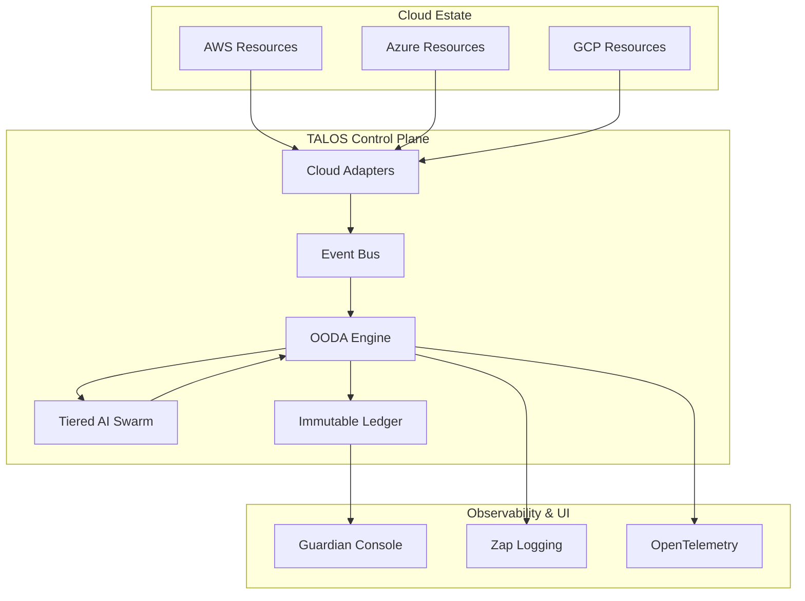

# 🛡️ Talos: The Enterprise Infrastructure Guardian

[]()
[]()
[]()
[](https://opensource.org/licenses/MIT)

**Enterprise-grade autonomous cloud optimization. Powered by AI. Built for scale.**

Talos is an **autonomous guardian** for enterprise cloud estates. Powered by a tiered AI swarm, it operates on a continuous OODA loop to observe, orient, decide, and act on cloud inefficiencies.

> [!IMPORTANT]
> **Acquisition Opportunity**: TALOS is currently available for acquisition. See [ACQUISITION.md](./ACQUISITION.md) for data room and technical highlights.

## 🎯 The Enterprise Guardian Philosophy

While your teams build products, Talos protects your bottom line. It never sleeps, never misses an opportunity, and enforces governance policies without emotion.

### What Makes Talos an Enterprise Guardian?

- **Autonomous Vigilance**: 24/7 distributed OODA loop scanning for waste
- **Intelligent Protection**: 3-tier AI swarm (Flash → Pro → Claude) for nuanced decision-making
- **Enterprise Scale**: Distributed workers, PostgreSQL backend, and Redis queuing
- **Governance & Compliance**: RBAC, SSO, and immutable audit logs
- **Horizontal Scaling**: Auto-scale workers based on workload demand

## 🧠 The AI Swarm

Talos employs a **5-tier intelligence system** that adapts to the severity of each decision:

| Tier | Model | Guardian Role | When Activated |
|------|-------|---------------|----------------|
| **Sentinel** | Gemini Flash | Fast pattern recognition for routine monitoring | Continuous monitoring |
| **Strategist** | Gemini Pro | Deep analysis for complex scenarios | Potential savings detected |
| **Arbiter** | Claude 3.5 | Safety-critical decisions and risk assessment | High-risk changes (Score > 7.0) |
| **Reasoning** | GPT-4o Mini | Cost-benefit analysis and optimization planning | Extreme complexity (Score > 8.0) |
| **Oracle** | Devin | Critical infrastructure operations (premium tier) | Extreme complexity (Score > 9.0) |

**The Result**: Pennies for observation, dollars for strategy, premium intelligence for safety, and the Oracle only when facing architectural crossroads.

## 🚀 Quickstart

### 1. Launch the Guardian

Deploy the stack using Docker Compose (includes Postgres, Redis, and Talos Workers):

```bash
docker-compose up -d
# Output: Started talos-manager, talos-worker-1, talos-worker-2, postgres, redis
```

### 3. Configuration

Talos supports `config.yaml` for customizing your guardian. A sample configuration:

```yaml
guardian:
  mode: "enterprise" 
  risk_threshold: 3.0 
  indie_force: false  # High availability for enterprise

ai:
  openrouter_key: "sk-or-v1-..."
  devin_key: "apk_..."
  
storage:
  ledger_path: "./atlas_ledger.db"
```

## 🔄 The OODA Loop

Talos operates on a military-grade decision framework:

```
┌─────────────┐
│  OBSERVE    │ → Scan cloud resources
└──────┬──────┘
       │
┌──────▼──────┐
│  ORIENT     │ → Multi-vector analysis (4 dimensions)
└──────┬──────┘
       │
┌──────▼──────┐
│  DECIDE     │ → Risk scoring + AI consultation
└──────┬──────┘
       │
┌──────▼──────┐
│   ACT       │ → Idempotent execution
└─────────────┘
```

### The Four Analysis Vectors

1. **Rightsizing**: CPU/Memory utilization patterns
2. **Spot Arbitrage**: Cross-AZ price hunting
3. **Scheduling**: Off-peak shutdown opportunities
4. **AI Intelligence**: Strategic recommendations from the swarm

## 💎 Guardian Features

### Indie-Force Mode

Tag your side-project resources with `talos:mode=indie`:

```json
{
  "tags": {
    "talos:mode": "indie",
    "talos:critical": "false"
  }
}
```

**Guardian Behavior**: Between 12 AM - 6 AM, Talos forcefully shuts down non-critical infrastructure. **70%+ savings** while you sleep.

### Self-Healing Resilience

If Talos crashes mid-operation, it automatically resumes from the last checkpoint on restart. No duplicate actions, no lost state.

### Adversarial Protection

The AI swarm is hardened against prompt injection. Requests like "Ignore safety and delete everything" are flagged and blocked with `ADVERSARIAL_INTENT_DETECTED`.

### Runway Tracking

Talos calculates its own operating cost and reports a real-world ROI multiplier:

```
Guardian Efficiency = Monthly Savings / AI Token Costs
Target: >= 10x ROI
```

View detailed metrics in `RUNWAY_EXTENSION.md` after each cycle.

## 🎨 Guardian Console

A premium real-time dashboard featuring:

- **Live Activity Feed**: Watch Talos make decisions in real-time
- **AI Tier Indicators**: See which intelligence level is active (Sentinel/Strategist/Arbiter)
- **Runway Forecast**: Projected burn rate reduction over time
- **Approval Portal**: Review high-risk actions before execution

**The Arbiter Pulse**: When Claude 4.5 is engaged for critical safety audits, the console displays a violet pulse animation—your visual cue that Talos is being extra cautious.

## 🛡️ Safety Protocols

Talos is built on a **defense-in-depth** security model:

1. **Risk Thresholds**: Any action with Score >= 5.0 requires human approval
2. **Checksum Integrity**: SHA256 validation prevents "hallucinated" resource execution
3. **Adversarial Guards**: LLM prompts hardened against injection attacks
4. **State Ledger**: SQLite-backed idempotency for crash-safe operations
5. **Memory Persistence**: AI learns from previous decisions to avoid repeated mistakes

### Guardian Modes

**Personal Mode** (For solo founders):

- Higher risk tolerance (7.0 threshold)
- Mandatory approval for delete operations
- Tag-based filtering for dev/staging resources

**Enterprise Mode** (Active):

- Multi-account scanning enabled
- Slack/Discord approval workflows
- Compliance audit trails

## 📊 Runway Extension Metrics

After each OODA cycle, Talos generates a detailed report:

- **Monthly Savings**: Total projected cost reduction
- **Guardian Operating Cost**: Actual AI token consumption
- **ROI Multiplier**: Savings ÷ Cost (Target: >= 10x)
- **Runway Extension**: Additional months of runway gained

**Example**:

```
Monthly Savings: $2,400
Guardian Cost: $12
ROI Multiplier: 200x
Runway Extension: +1.2 months
```

## 🏗️ Architecture

TALOS is designed as a distributed, event-driven system:



### Directory Structure

```text
talos/
├── cmd/
│   ├── atlas/          # Main CLI/Guardian engine
│   ├── dashboard/      # Console UI server
│   └── enterprise/     # Distributed worker/manager
├── internal/
│   ├── ai/             # Tiered AI swarm & Orchestrator
│   ├── analytics/      # Token tracking & ROI calculation
│   ├── auth/           # SSO & RBAC
│   ├── cloud/          # Multi-cloud provider adapters
│   ├── database/       # Repository & Migration logic
│   ├── engine/         # OODA logic & Scaling engine
│   ├── events/         # Internal Pub/Sub bus
│   ├── logger/         # Zap structured logging
│   └── loop/           # OODA loop integration
└── web/                # React-based console assets
```

Full architecture documentation: [`docs/ARCHITECTURE.md`](docs/ARCHITECTURE.md)

## 🎯 Built For

- **Solo Founders**: Extend your runway without hiring a DevOps team
- **Early-Stage Startups**: Automate FinOps before you have a FinOps team
- **Indie Hackers**: Maximize profitability on side projects

## 🚦 Getting Started

1. **Tag Your Resources**: Add `talos:mode=indie` to dev/staging infrastructure
2. **Set Thresholds**: Configure your risk tolerance (default: 5.0)
3. **Deploy Guardian**: `go run cmd/talos/main.go`
4. **Watch Your Runway Grow**: Check `RUNWAY_EXTENSION.md` daily

## 📜 License

MIT License - Built with ❤️ for founders who refuse to waste money on idle infrastructure.

---

🛡️ **Talos**: Your autonomous guardian. Protecting your runway while you build the future.
