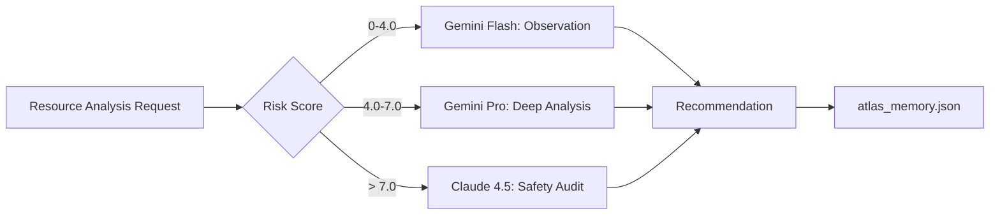

# Project Atlas: System Architecture

## Overview

Project Atlas is an enterprise-grade autonomous cloud optimization platform built on a distributed multi-agent OODA loop. It features multi-tenancy, RBAC, and horizontal scalability via a worker swarm architecture.

## System Architecture

```mermaid
graph TB
    subgraph "Control Plane"
        LB[Load Balancer] --> API[API Gateway / GraphQL]
        API --> AUTH[Auth Service (SSO/OIDC)]
        API --> MGR[Swarm Manager]
        MGR --> REDIS[Redis Task Queue]
    end
    
    subgraph "Worker Swarm (Horizontal Scale)"
        REDIS --> W1[Worker-1 (AWS)]
        REDIS --> W2[Worker-2 (GCP)]
        REDIS --> W3[Worker-N]
        
        W1 & W2 & W3 --> F[1. Observe]
        F --> G[2. Orient: Multi-Vector Analysis]
        G --> H[3. Decide: Risk Scoring]
        H --> I[4. Act: Idempotent Execution]
    end
    
    subgraph "Intelligence Layer"
        J[AI Gateway] --> K[Tier 1: Gemini Flash]
        J --> L[Tier 2: Gemini Pro]
        J --> M[Tier 3: Claude 4.5]
        G --> J
    end
    
    subgraph "Safety & State"
        I --> N[Idempotency Engine]
        N --> DB[(PostgreSQL Cluster)]
        N --> P[Checksum Validator]
        H --> Q[Risk Engine]
        Q --> R[Policy Engine (OPA)]
    end
    
    subgraph "Persistence"
        J --> V[Vector DB (Pinecone/Weaviate)]
        I --> TS[TimescaleDB (Metrics)]
        TS --> DASH[Grafana / Enterprise UI]
    end
```

## Component Breakdown

### 1. Cloud Adapters (`internal/cloud`)

**Purpose**: Abstract multi-cloud resource discovery and manipulation.

**Key Files**:

- `adapter.go`: CloudAdapter interface definition
- `aws_adapter.go`: AWS implementation with mock resources
- `simulator.go`: Local testing provider

**Flow**:

```
CloudAdapter.FetchResources() → []Resource
CloudAdapter.ApplyOptimization(id, type) → Result
```

### 2. Multi-Vector Analysis (`internal/engine`)

**Purpose**: Identify optimization opportunities across multiple dimensions.

**Vectors**:

- **Rightsizing**: CPU/Memory utilization analysis
- **Spot Arbitrage**: Cross-AZ price comparison
- **Scheduling**: Off-peak shutdown planning
- **AI Intelligence**: LLM-backed strategic recommendations

**Key Files**:

- `arbitrage.go`: Spot price arbitrage logic
- `scheduler.go`: Time-based scheduling + Indie-Force strategy

### 3. Adaptive AI Routing (`internal/ai`)

**Purpose**: Cost-efficient LLM intelligence with tiered model selection.



**Key Features**:

- **Memory Persistence**: Previous decisions injected into prompts
- **Exponential Backoff**: Graceful 429 rate limit handling
- **Adversarial Guards**: Prompt injection protection

### 4. Idempotency Engine (`internal/idempotency`)

**Purpose**: Crash-safe, exactly-once execution semantics.

**State Machine**:

```
PENDING → (crash) → RESUMING → EXECUTING → COMPLETED
                                    ↓
                                 FAILED
```

**Safety Mechanisms**:

- SHA256 checksum validation
- SQLite ledger for state persistence
- Zombie process recovery on startup

### 5. Risk Scoring (`internal/risk`)

**Purpose**: Quantify the danger of each optimization action.

**Formula**:

```
Score = (Impact × 10) - (Risk × 2)
where:
  Impact = Projected Monthly Savings
  Risk = f(CPU%, Memory%, Stability)
```

**Governance**:

- Score >= 5.0 → `AWAITING_APPROVAL`
- Personal Mode: Threshold raised to 7.0
- Delete operations: Always require approval

### 6. Mission Control Dashboard (`web/`)

**Purpose**: Real-time visualization of swarm activity.

**Features**:

- **SSE Streaming**: Live tail of `SESSION_LOG.json`
- **AI Tier Badges**: Visual indicators for Flash/Pro/Claude
- **Glassmorphic UI**: Premium dark mode design
- **Interactive Approvals**: Click-to-approve high-risk actions

**Tech Stack**:

- Vanilla JavaScript + Chart.js
- Server-Sent Events (SSE)
- CSS animations (Claude pulse effect)

## Data Flow

### Optimization Cycle

```
1. Worker.RunCycle() starts
2. CloudAdapter.FetchResources() → []Resource
3. For each resource:
   a. RiskEngine.CalculateScore() → Analysis
   b. ArbitrageEngine.FindOpportunity() → Plan
   c. Scheduler.GenerateSchedulePlan() → Plan
   d. AIClient.AnalyzeTiered(risk) → Recommendation
4. IdempotencyEngine.ExecuteGuarded():
   a. Generate SHA256 checksum
   b. Check ledger for existing state
   c. If PENDING → Resume
   d. If new → Record PENDING
   e. Validate risk threshold
   f. Execute action
   g. Mark COMPLETED
5. Logger.LogAction() → SESSION_LOG.json
6. Dashboard streams via SSE
```

## Security Model

### Defense in Depth

1. **Input Validation**: Checksum integrity on all payloads
2. **Adversarial Guards**: LLM system prompts hardened against injection
3. **Strict Thresholds**: >= 5.0 risk score requires human approval
4. **State Encryption**: AES-256-GCM for sensitive session data
5. **Audit Trail**: Immutable `SESSION_LOG.json` for forensics

### Personal Mode Safeguards

When `IdempotencyEngine.PersonalMode = true`:

- Risk threshold raised to 7.0
- All delete operations require approval
- Tag-based filtering (`atlas:mode=indie`)

## Performance Characteristics

### Latency Targets

- **Observation**: < 2s per cloud account
- **AI Analysis**: < 5s (Flash), < 15s (Pro), < 30s (Claude)
- **Execution**: < 10s per action
- **Full Cycle**: < 60s for 100 resources

### Cost Efficiency

**Target ROI**: >= 10x

```
Monthly Swarm Cost = Σ(AI Token Usage × $0.25/1M tokens)
Monthly Savings = Σ(Optimizations × Impact)
ROI Multiplier = Savings / Cost
```

**Typical Costs**:

- Gemini Flash: $0.0001 per analysis
- Gemini Pro: $0.0005 per analysis
- Claude 4.5: $0.003 per safety audit

## Deployment Architecture

### Single-Node (Current)

```
┌─────────────────────────────────┐
│   Project Atlas (Single Binary) │
│                                  │
│  ┌──────────┐    ┌────────────┐ │
│  │  Worker  │───▶│ Dashboard  │ │
│  │  Loop    │    │  Server    │ │
│  └──────────┘    └────────────┘ │
│       │               │          │
│       ▼               ▼          │
│  atlas_ledger.db  :8080         │
└─────────────────────────────────┘
```

### Future: Distributed Swarm

```
┌──────────┐     ┌──────────┐     ┌──────────┐
│ Worker 1 │────▶│  Redis   │◀────│ Worker N │
│ (AWS)    │     │ (State)  │     │ (GCP)    │
└──────────┘     └──────────┘     └──────────┘
                       │
                       ▼
                 ┌──────────┐
                 │Dashboard │
                 │ Cluster  │
                 └──────────┘
```

## Extension Points

### Adding a New Cloud Provider

1. Implement `CloudAdapter` interface in `internal/cloud/`
2. Define resource mapping to `cloud.Resource` struct
3. Register in `cmd/atlas/main.go`

### Adding a New Optimization Vector

1. Create new engine in `internal/engine/`
2. Implement `GeneratePlan(Resource) → ActionPlan`
3. Integrate into `Worker.RunCycle()`

### Adding a New AI Model

1. Add model constant to `internal/ai/openrouter.go`
2. Update `AnalyzeTiered()` routing logic
3. Adjust token cost estimates in `Reporter`

---

🏛️ **Project Atlas**: Built for scale, designed for autonomy.
